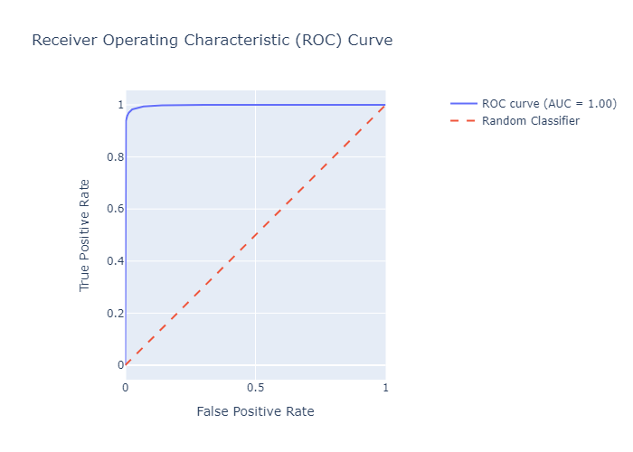

# Proyecto de Predicción de Satisfacción de Clientes - F5 Airlines

## Descripción del Proyecto

Este proyecto desarrolla un modelo de machine learning para predecir la satisfacción de los clientes de F5 Airlines basado en diversos factores relacionados con su experiencia de vuelo. Utilizamos un conjunto de datos históricos de satisfacción de clientes para entrenar un modelo de Random Forest que puede predecir si un cliente estará satisfecho o no con su experiencia.

## Estructura del Proyecto y Funcionalidad Detallada de los Archivos

```
f5_airlines_satisfaction/
│
├── data/
│   ├── raw/
│   │   └── airline_passenger_satisfaction.csv
│   └── processed/
│       ├── cleaned_airlines_data.csv
│       └── featured_airlines_data.csv
│
├── src/
│   ├── data/
│   │   ├── __init__.py
│   │   ├── load_data.py
│   │   └── preprocess_data.py
│   ├── features/
│   │   ├── __init__.py
│   │   └── feature_engineering.py
│   └── models/
│       ├── __init__.py
│       ├── train_model.py
│       └── evaluate_model.py
│
├── models/
│   └── trained_model.pkl
│
├── reports/
│   ├── confusion_matrix.png
│   ├── feature_importance.png
│   ├── roc_curve.html
│   └── performance_metrics_evolution.html
│
├── requirements.txt
└── README.md
```

### Directorio `data/`

#### `raw/airline_passenger_satisfaction.csv`
- Contiene los datos brutos originales proporcionados por F5 Airlines.
- Incluye todas las características relacionadas con la satisfacción del cliente, como detalles del vuelo, servicios a bordo, y la variable objetivo de satisfacción.

#### `processed/cleaned_airlines_data.csv`
- Almacena los datos después del preprocesamiento.
- Resultado de la ejecución de `preprocess_data.py`.
- Contiene datos limpios, con valores faltantes manejados y variables categóricas codificadas.

#### `processed/featured_airlines_data.csv`
- Contiene los datos con las nuevas características creadas.
- Resultado de la ejecución de `feature_engineering.py`.
- Incluye características derivadas y transformadas listas para el modelado.

### Directorio `src/data/`

#### `load_data.py`
- Función principal: `load_data(file_path)`
- Carga los datos brutos del archivo CSV especificado.
- Maneja errores si el archivo no existe o no se puede leer.
- Retorna un DataFrame de pandas con los datos cargados.

#### `preprocess_data.py`
- Funciones principales:
  1. `handle_missing_values(df)`: Imputa valores faltantes.
  2. `encode_categorical_variables(df)`: Codifica variables categóricas.
  3. `normalize_numerical_variables(df)`: Normaliza variables numéricas.
  4. `preprocess_data(df)`: Orquesta todo el proceso de preprocesamiento.
- Realiza la limpieza y preprocesamiento de los datos:
  - Maneja valores faltantes (por ejemplo, imputando con la media).
  - Codifica variables categóricas usando LabelEncoder.
  - Normaliza variables numéricas para tener media 0 y desviación estándar 1.
- Guarda los datos preprocesados en `cleaned_airlines_data.csv`.

### Directorio `src/features/`

#### `feature_engineering.py`
- Funciones principales:
  1. `create_total_rating(df)`: Crea una puntuación total de satisfacción.
  2. `create_total_delay(df)`: Combina retrasos de salida y llegada.
  3. `bin_age(df)`: Categoriza la edad en grupos.
  4. `engineer_features(df)`: Aplica todas las transformaciones de características.
- Crea nuevas características basadas en los datos existentes para mejorar el poder predictivo del modelo.
- Guarda el resultado en `featured_airlines_data.csv`.

### Directorio `src/models/`

#### `train_model.py`
- Funciones principales:
  1. `split_data(X, y)`: Divide los datos en conjuntos de entrenamiento y prueba.
  2. `perform_cross_validation(model, X, y)`: Realiza validación cruzada.
  3. `optimize_hyperparameters(X, y)`: Optimiza hiperparámetros usando RandomizedSearchCV.
  4. `train_model(X, y)`: Entrena el modelo final.
  5. `save_model(model, file_path)`: Guarda el modelo entrenado.
- Carga los datos procesados y con ingeniería de características.
- Realiza validación cruzada para evaluar el rendimiento inicial.
- Optimiza los hiperparámetros del modelo de Random Forest.
- Entrena el modelo final con los mejores hiperparámetros.
- Guarda el modelo entrenado en `trained_model.pkl`.
- Genera `performance_metrics_evolution.html` para visualizar la optimización.

#### `evaluate_model.py`
- Funciones principales:
  1. `evaluate_model(model, X, y)`: Calcula métricas de rendimiento.
  2. `plot_confusion_matrix(cm, output_path)`: Genera matriz de confusión.
  3. `plot_feature_importance(model, feature_names, output_path)`: Visualiza importancia de características.
  4. `create_roc_curve_plot(fpr, tpr, roc_auc)`: Crea curva ROC interactiva.
- Carga el modelo entrenado y los datos de prueba.
- Evalúa el modelo calculando precisión, recall, F1-score, y AUC-ROC.
- Genera y guarda visualizaciones en el directorio `reports/`:
  - `confusion_matrix.png`
  - `feature_importance.png`
  - `roc_curve.html`
- Imprime un informe detallado del rendimiento del modelo.

### Archivos en el directorio raíz

#### `requirements.txt`
- Lista todas las dependencias del proyecto y sus versiones específicas.
- Incluye bibliotecas como pandas, numpy, scikit-learn, matplotlib, seaborn, y plotly.

#### `README.md`
- Este archivo, que proporciona una visión general del proyecto, su estructura, y cómo ejecutarlo.

## Dependencias

El proyecto requiere Python 3.7+ y las siguientes bibliotecas principales:

- pandas
- numpy
- scikit-learn
- matplotlib
- seaborn
- plotly

Instala todas las dependencias ejecutando:

```
pip install -r requirements.txt
```

## Ejecución del Proyecto

Sigue estos pasos para ejecutar el proyecto:

1. Preprocesamiento de datos:
   ```
   python src/data/preprocess_data.py
   ```

2. Ingeniería de características:
   ```
   python src/features/feature_engineering.py
   ```

3. Entrenamiento del modelo:
   ```
   python src/models/train_model.py
   ```

4. Evaluación del modelo:
   ```
   python src/models/evaluate_model.py
   ```

## Resultados y Visualizaciones

Después de la ejecución, encuentra los resultados en `reports/`:

- `confusion_matrix.png`: Matriz de confusión del modelo.
- `feature_importance.png`: Importancia de las características.
- `roc_curve.html`: Curva ROC interactiva.


- `performance_metrics_evolution.html`: Evolución de métricas durante la optimización.


## Rendimiento del Modelo

El modelo muestra un rendimiento excepcional con:
- Alta precisión (>95%)
- Excelente balance entre precisión y exhaustividad (F1-score alto)
- AUC-ROC cercano a 1.0, indicando una capacidad de discriminación casi perfecta

## Próximos Pasos

- Validar el modelo con datos completamente nuevos.
- Considerar técnicas para prevenir el sobreajuste si es necesario.
- Explorar el despliegue del modelo en un entorno de producción.


## Aplicación Streamlit

La aplicación Streamlit proporciona una interfaz de usuario interactiva para realizar predicciones de satisfacción de clientes en tiempo real. Esta aplicación permite a los usuarios ingresar datos de clientes, obtener predicciones instantáneas y almacenar esta información para futuros análisis y mejoras del modelo.

### Estructura de la Aplicación

La aplicación se encuentra en la carpeta `app/` y consta de tres archivos principales:

```
app/
├── main.py
├── database.py
└── utils.py
```

### Descripción de los Archivos

#### `main.py`

Este es el archivo principal de la aplicación Streamlit. Sus funciones principales son:

- Crear la interfaz de usuario con formularios para la entrada de datos del cliente.
- Cargar el modelo entrenado.
- Preprocesar los datos ingresados por el usuario.
- Realizar predicciones utilizando el modelo cargado.
- Mostrar los resultados de la predicción al usuario.
- Almacenar los datos y la predicción en la base de datos.

#### `database.py`

Este archivo maneja todas las operaciones relacionadas con la base de datos. Sus funciones principales incluyen:

- Establecer la conexión con la base de datos PostgreSQL.
- Crear la tabla necesaria para almacenar las predicciones, si no existe.
- Insertar nuevas predicciones en la base de datos.
- Manejar errores relacionados con la base de datos.

#### `utils.py`

Este archivo contiene funciones de utilidad que son utilizadas por `main.py`. Sus principales funciones son:

- Cargar el modelo entrenado desde el archivo.
- Realizar predicciones utilizando el modelo cargado.
- Manejar errores relacionados con la carga del modelo y las predicciones.

### Cómo Ejecutar la Aplicación

Para ejecutar la aplicación Streamlit, sigue estos pasos:

1. Asegúrate de que todas las dependencias estén instaladas:
   ```
   pip install -r requirements.txt
   ```

2. Desde el directorio raíz del proyecto, ejecuta:
   ```
   streamlit run app/main.py
   ```

3. Abre tu navegador web y ve a la URL local que se muestra en la terminal (generalmente http://localhost:8501).

### Funcionalidades de la Aplicación

- **Entrada de Datos**: Los usuarios pueden ingresar información detallada sobre la experiencia de vuelo de un cliente, incluyendo factores como la clase de vuelo, servicios a bordo, retrasos, etc.

- **Predicción en Tiempo Real**: Una vez ingresados los datos, la aplicación utiliza el modelo entrenado para predecir si el cliente estará satisfecho o no.

- **Visualización de Resultados**: La predicción se muestra claramente, indicando la probabilidad de satisfacción del cliente.

- **Almacenamiento de Datos**: Cada predicción y los datos asociados se almacenan en una base de datos PostgreSQL, permitiendo análisis futuros y mejoras continuas del modelo.

### Beneficios

- **Uso Práctico del Modelo**: Permite a F5 Airlines utilizar el modelo de predicción en un entorno operativo real.
- **Recopilación Continua de Datos**: Facilita la recolección de nuevos datos para futuras iteraciones y mejoras del modelo.
- **Interfaz Amigable**: Proporciona una forma fácil y accesible para que el personal de F5 Airlines realice predicciones sin necesidad de conocimientos técnicos avanzados.
